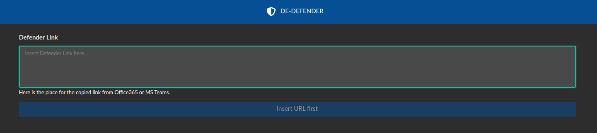

# DeDefender

Just a simple webpage stored in a html file and a browser extension.
It has an input box which accepts an url which is protected by Microsoft Cloud Defender and unpacks it.
Those urls can be retrieved by the Office 365 Outlook or Teams.

## Features

* Unwraps Urls from the Microsoft Cloud Defender

## Use page from GitHub Pages

1. Goto https://poeschl.github.io/DeDefender
2. Use it

## Install page locally

1. Download the singe-file-application as `dedefender.html` from [here](https://github.com/Poeschl/DeDefender/raw/gh-pages/index.html)
2. Open it in your browser
3. Use it

## Install browser extension

The browser extension will automatically convert any anchor starting with `https://mcas-proxyweb.mcas.ms` to the unwrapped reference on
every `https://*.mcas.ms` web page.

1. Download the [Chrome extension](https://github.com/Poeschl/DeDefender/raw/gh-pages/DeDefender.crx)
   or [FireFox addon](https://github.com/Poeschl/DeDefender/raw/gh-pages/DeDefender.xpi).
2. Install them in your browser (somewhere in the addons/extensions settings)

## Note

This software will get no versioning and lives on the bloody main branch.

## Development

Run `npm run dev` to get the development environment at http://localhost:5173.
